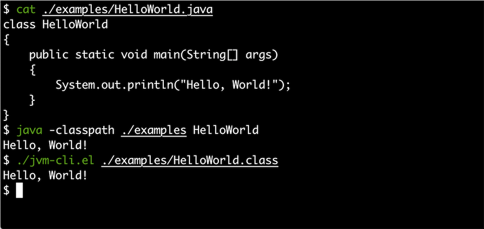
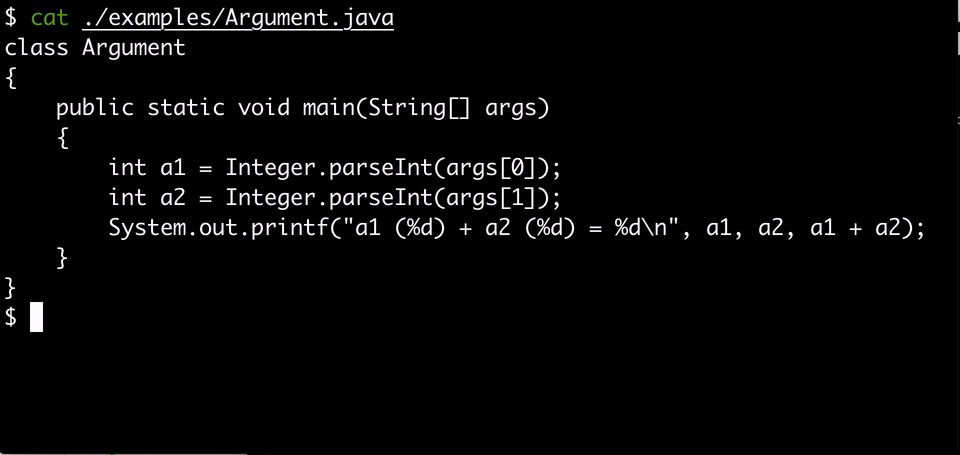

# Implement JVM by Emacs

## CAUTION

`emacs-jvm` is an **experimental project** .

## DEMONSTRATION

| HelloWorld.java                             | Argument.java                               |
|---------------------------------------------+---------------------------------------------|
|  |  |

## USAGE

1. Fetch this repository:

    ```
    $ git clone https://github.com/gongo/emacs-jvm.git
    $ cd emacs-jvm/
    ```

2. Compile example Java program:

    ```
    $ javac examples/HelloWorld.java
    ```

3. Enjoy!

    ```
    $ java -classpath ./examples HelloWorld
    $ ./jvm-cli.el ./examples/HelloWorld.class
    ```

## LICENSE

MIT
